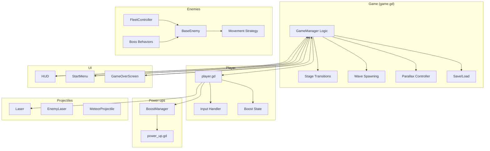
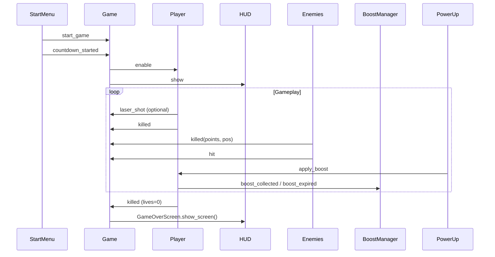
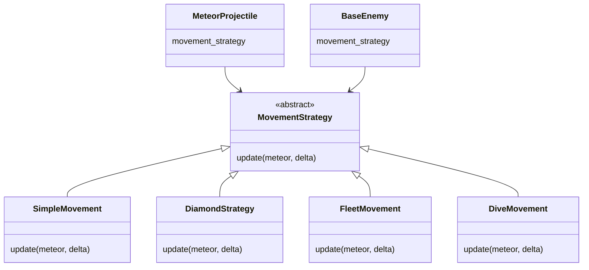

# Astral Burst — Architecture Overview

## High-Level System Diagram



---

## Scene Hierarchy (Simplified)

```
Game (game.tscn)
├── ParallaxBackground
│   ├── MoonLayer, EarthLayer, MarsLayer, ...
│   └── (Planetary sprites)
├── Player (or PlayerSpawnPos)
├── EnemyContainer
├── LaserContainer
├── PowerupContainer (created at runtime)
├── FleetController (created at runtime)
├── BoostManager (created at runtime)
├── Camera2D
├── UILayer
│   ├── HUD
│   ├── StartMenu
│   └── GameOverScreen
├── IntroEarth
├── DeathBlur, DeathFlash
└── SFX (HitSound, ExplodeSound, MusicPlayer, ...)
```

---

## Signal Flow



---

## Movement Strategy Pattern



---

## Stage Progression Flow

```mermaid
flowchart LR
    SPACE -->|10k| MOON
    MOON -->|25k| MARS
    MARS -->|35k| ASTEROID_BELT
    ASTEROID_BELT -->|50k| JUPITER
    JUPITER -->|75k| SATURN
    SATURN -->|90k| URANUS
    URANUS -->|105k| NEPTUNE
    NEPTUNE -->|125k| SCATTERED
    SCATTERED -->|140k| KUIPER_BELT
    KUIPER_BELT -->|160k| OORT_CLOUD
```


